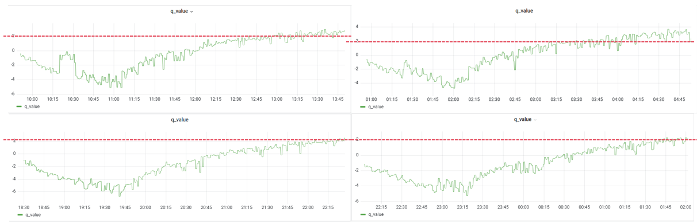
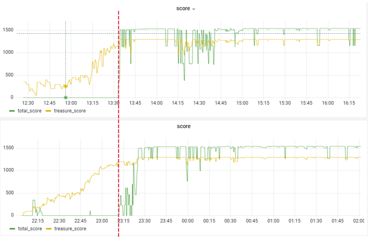

## 实践作业二：王者荣耀开悟平台——重返秘境

这次实验是一个固定地图中多个目标点的路径规划任务，我主要从观测、奖励工程、DQN算法和内在奖励对baseline进行了优化。最终，我13个宝箱1000步的测评得分为1556，目测几乎走出了最短路径。

### 观测

在考虑奖励之前我们需要确定观测的内容，设计的奖励必须存在对应的观测，否则会带来部分可观测问题——智能体并不知道什么情况下可以再次获得奖励。通过chatgpt整理观测如下表。可以看到观测已经经过了白化（归一化）处理便于模型去学习，然后这些一维/二维的观测包括了当前位置、相对的宝箱位置、相对的终点位置以及buff和闪现是否可用的bool变量，还有局部的障碍物/宝箱/Buff/终点的分布图。

| 名称                     | 计算方式 / 来源                                              | 维度     | 含义                                                         |
| ------------------------ | ------------------------------------------------------------ | -------- | ------------------------------------------------------------ |
| 1. 归一化位置 `norm_pos` | `[norm_pos.x, norm_pos.z]`                                   | 2        | 当前坐标在世界范围内的归一化值（通常在 [0,1] 之间）          |
| 2. 网格位置 One-hot 编码 | `one_hot_encoding(grid_pos)`                                 | 256      | 将 2D 网格坐标 `grid_pos` 拆成 (row, col)，对每个坐标做 128 维 one-hot，合并成 256 维 |
| 3. 相对终点位置信息      | `read_relative_position(end_pos)`                            | 9        | 当前点到终点的相对向量（距离, 角度）                         |
| 4. 相对所有宝箱位置信息  | 遍历 15 个 `treasure_pos`，每个调用 `read_relative_position` | 9×15=135 | 当前点到每个宝箱的相对特征，同上                             |
| 5. Buff 可采集标志       | 遍历 `env_info.frame_state.organs`                           | 1        | 如果场上存在子类型为 2 的 organ，取其 `status`；否则 0       |
| 6. 闪现技能可用标志      | `env_info.frame_state.heroes[0].talent.status`               | 1        | 英雄闪现技能的冷却状态：1 可用，0 不可用                     |

| 名称              | 来源                           | 维度       | 含义                                       |
| ----------------- | ------------------------------ | ---------- | ------------------------------------------ |
| 1. `obstacle_map` | `raw_obs.feature.obstacle_map` | 51×51=2601 | 地形障碍物分布：1 表示阻挡，0 表示通行     |
| 2. `end_map`      | `raw_obs.feature.end_map`      | 2601       | 终点所在位置的热力图（典型为中心区域为 1） |
| 3. `treasure_map` | `raw_obs.feature.treasure_map` | 2601       | 所有宝箱位置的热力图                       |
| 4. `memory_map`   | `raw_obs.feature.memory_map`   | 2601       | 已访问区域或记忆区域的标记                 |

**改进一**：action mask

我们发现baseline的legal_act也就是action mask只考虑了闪现是否可用。我通过障碍物地图obstacle_map判断那些动作会撞墙，直接构造8个移动/闪现方向的action mask，显然对比通过撞墙的样本去学会“不撞墙”，直接裁剪那些撞墙的动作空间可以极大地加速模型学习。

### 奖励工程

进一步分析观测，其实相对的宝箱/终点位置是全局观测，可以用来构建稠密奖励，这一定程度降低了问题难度。利用全局观测，可以设计终点/宝箱/Buff的靠近/日常/稠密奖励（和任务得分不直接相关，但可以激励模型学习去获得任务奖励）。我们需要保证最后模型输出Q值的方差尽可能接近于1，因为Q值过大时神经网络拟合起来很困难，训练效率下降；过小时会无法区分动作，它们的Q值过于接近。因此， 日常奖励设置为1e-1这个量级，任务奖励为1e0这个量级。

**改进二**：奖励工程，具体奖励设计如下表：

| 奖励名称                            | 触发条件                                                     | 计算方式／公式                                     | 奖励量级            |
| ----------------------------------- | ------------------------------------------------------------ | -------------------------------------------------- | ------------------- |
| **靠近终点** `reward_end_dist`      | 非第一帧 且 已收集完所有宝箱                                 | `+0.2` if `end_dist<prev_end_dist` else `-0.2`     | ±0.2                |
| **获胜** `reward_win`               | 本帧 `terminated=True` 且 已收集完所有宝箱                   | 固定                                               | +10                 |
| **靠近宝箱** `reward_treasure_dist` | 仍有剩余宝箱                                                 | `+0.2` if `cur_dist<prev_dist` else `-0.2`         | ±0.2                |
| **拾取宝箱** `reward_treasure`      | 本帧比上一帧多拾取了一个宝箱                                 | 固定                                               | +5                  |
| **靠近 Buff** `reward_buff_dist`    | Buff 可收集 且 上一帧、当前帧均未拾取                        | `+0.05` if `buff_dist<prev_buff_dist` else `-0.05` | ±0.05               |
| **拾取 Buff** `reward_buff`         | 本帧获得 Buff                                                | 固定                                               | +1                  |
| **闪现使用** `reward_flicker`       | 有效闪现：位移距离 ≥7500 无效闪现（撞墙）：位移距离 <7500 | `+2` / `-2`                                        | ±2                  |
| **每步惩罚** `reward_step`          | 每一步                                                       | 固定                                               | –0.01               |
| **撞墙惩罚** `reward_bump`          | 本帧移动距离小于500（`is_bump=True`）                        | 固定                                               | –1                  |
| **重复探索** `reward_memory`        | 在已访问过的记忆格子中心位置                                 | `memory_map[center] × (–0.005)`                    | 取决于 `memory_map` |

### DQN算法

这部分我主要是对Rainbow进行复现。然而由于框架限制，buffer的代码没有开放，我们无法改动buffer的设计，因而跟采样相关的n-step learning（buffer需要以n-step为单位进行数据存取）以及PER（考虑td-error的不均匀采样）无法实现。

**改进三**：Double Q-Learning

target DQN通过目标网络将td目标中的Q网络固定住，稳定了训练过程，其loss定义如下
$$
\left(R_{t+1}+\gamma_{t+1} max_{a}q_{\bar{\theta}}(S_{t+1},a)-q_\theta\left(S_t, A_t\right)\right)^2
$$
但是由于神经网络拟合的误差通常会出现某些动作的估算有正误差的情况，而max操作又恰好选中了这些过高的Q值，我们的更新目标就会出现过高估计over-estimation，更新之后$(S_t,a)$也会over-estimation， 这样的误差会逐步累积传递，影响训练。因此，Double Q-Learning提出了利用另外一个神经网络来选取价值最大的动作，而这个角色正好可以让target DQN中的目标网络来担任。loss定义如下
$$
\left(R_{t+1}+\gamma_{t+1} q_{\bar{\theta}}\left(S_{t+1}, \operatorname{argmax} q_\theta\left(S_{t+1}, a^{\prime}\right)\right)-q_\theta\left(S_t, A_t\right)\right)^2
$$
**改进四**：Dueling Network

这个改进是将原来的Q值函数分成状态价值函数V和优势函数A两部分来建模，这样的好处在于：某些情况下智能体只关注状态的价值，而并不关心动作导致的差异，此时如果是Q值函数我们需要更新多个状态动作对，分开建模只需更新V即可，大大提高学习效率。

但是直接分开存在对V值和A只建模不唯一的问题，V值减去一个常数C，A值加上C得到的Q值相同。可以通过减去A值的一个统计量（最大值、均值）来固定基准以解决。
$$
q_\theta(s, a)=v_\eta\left(f_{\xi}(s)\right)+a_\psi\left(f_{\xi}(s), a\right)-\frac{\sum_{a^{\prime}} a_\psi\left(f_{\xi}(s), a^{\prime}\right)}{N_{\text {actions }}}
$$
这个实现也很简单，观测通过CNN模型之后，分别输入到value_head和advantage_head两个独立的mlp网络，将输出带入上式计算即可得到估计的Q值。

**由于平台的资源有限，无法做很完整的benchmark，而且任务本身难度较低针对算法的改进效果其实不明显，只能截图几次的训练曲线简单对比一下。**

下面是训练的Q值曲线，A是target DQN+学习率线性衰减，B是target DQN，C1,2是D3QN（Double Dueling DQN）+学习率线性衰减，可以看到D3QN一定程度上缓解了over-estimation。

**失败的改进五**：Noisy Network

就是将Linear层替换为Noisy Linear，计算公式为：
$$
\boldsymbol{y}=(b+\mathbf{W} x)+\left(b_{\text {noisy }} \odot \epsilon^b+\left(\mathbf{W}_{\text {noisy }} \odot \epsilon^w\right) x\right)
$$
其中epsilon是随机变量，$W_{noisy}$和$b_{noisy}$为可学习的噪声参数。随着优化进行，网络可以学会忽略这些噪声，而这个过程对状态空间的不同部分速度是不同的——模拟了一种退火的state-conditional探索。

但是实操效果不太好，智能体甚至无法达到终点，可能是我实现的问题，或者可能是Noisy Network需要在完整rainbow实现的配合下才能work得比较好（曾伊言）。

### 内在奖励

**改进六**：RND构建探索奖励

这里我主要复现了“Exploration by Random Network Distillation”这个工作。RND核心是将一个随机初始化的神经网络蒸馏到一个可训练的网络中，我们会通过梯度下降来最小化以下期望均方误差：
$$
\mathbb{E}_{x \sim \mathcal{D}}\left\|\hat{f}\left(x ; \theta_{\hat{f}}\right)-f(x)\right\|^2
$$
然后将这个误差项作为内在奖励给到智能体。可以预见，随着目标类别训练样本数量的增加，测试误差会不断下降，内在奖励减少；而在达到一个新颖状态时可以获得更高的内在奖励——鼓励智能体去探索新颖的状态。

参照论文的设置，我对观测进行了归一化再输入到这两个RND网络中。具体为：

1. 对每个维度的观测值先减去其滚动均值（running mean），再除以其滚动标准差（running standard deviation）来“白化”数据；
2. 将归一化后的观测值裁剪到 [−5,5] 区间。

同样，也对内在奖励做归一化处理：将其除以内在回报的标准差的在线估计值（奖励非负不能减去均值）。

归一化参数需要动态更新。同时为了初始化这些参数，在正式训练前，需要让一个随机策略在环境中运行若干步。最后，由于平台是分布式的训练架构，归一化参数在load_model和save_model要像模型一样实现对应的加载和存储操作。

下面是加了内在奖励（上）和没加之前（下）的任务的得分曲线对比，有轻微的训练效率改进。

